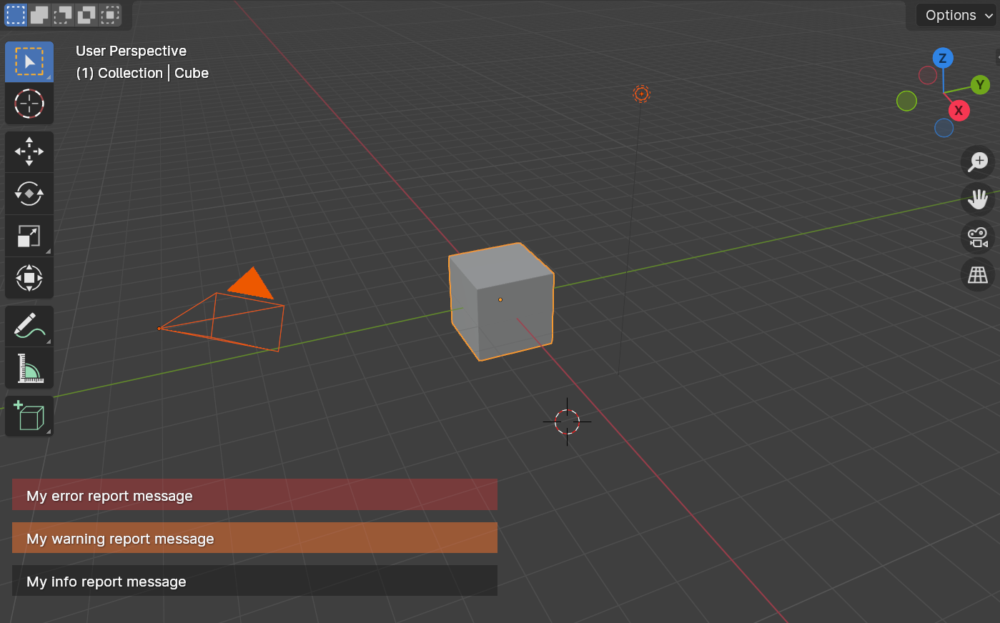
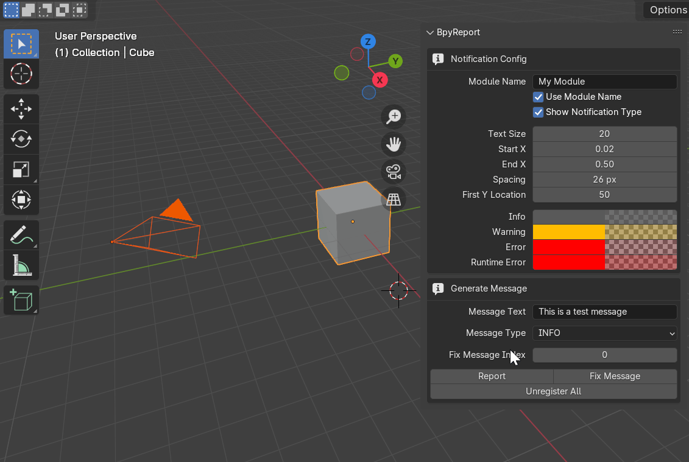

# BpyReport

**BpyReport** is a submodule designed to simplify and enhance the reporting of messages in Blender add-ons. It provides a more efficient and controlled way to display report messages with minimal setup.

## Installation

Installing **BpyReport** is straightforward. Simply clone the `src/bpyreport` directory into an internal folder of your add-on (e.g., a `libs` folder). You can then access the `bpyreport` module through relative imports in any module of your add-on.

```bash
your_addon_module
├── addon
├── libs # internal libs folder
│   └── bpyreport # BpyReport submodule
└── __init__.py  # Your add-on init file
```

## Usage

Using **BpyReport** is very simple. To display an information message, follow the example below:

```python
from .libs import bpyreport

bpyreport.info("My info report message")
bpyreport.warning("My warning report message")
bpyreport.error("My error report message")
```
Result:



## Testing
You can dynamically test all functionalities of the BpyReport submodule using the bpyreport-addon. This add-on provides all possible configurations in a simple and easily testable format.


